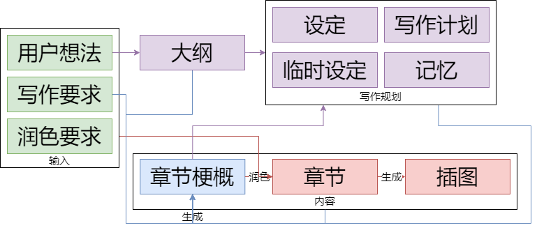

# 轻小说生成器

## 简介

近年来，AI在文学创作领域取得了显著进展。从AI微小说大赛到阅文妙笔，再到Midreal AI，这些案例都证明了AI在文学创作上的巨大潜力。我希望通过大语言模型与多智能体技术，来开发一款能够自动生成轻小说的应用。

相较于通常的网络小说，轻小说具有以下两个特点：

- 段落较为短小；
- 具有插图。

相应的，基于原作者cjyyxn工作，本项目做以下改进：
- 加入插图生成功能；
- 新增临时设定部分，以确保在相邻若干章节内能够添加特定设定；
- 补充了下载已生成轻小说功能；
- 优化代码结构；
- 调整了多智能体的propmt。



## 快速上手指南

### 步骤1: 环境配置

最好使用`python3.8`进行使用。

首先，安装所需的依赖项：

```bash
pip install -r requirements.txt
```

### 步骤2: 实现LLM接口

项目依赖两个大语言模型——对话、文生图。你需要实现`LLM.py`中的`chatLLM`和`picLLM`函数。

已经支持的大语言模型有：

- 阿里百炼：文本生成&文生图；
- deepseek：文本生成；
- 智谱AI：文本生成。

对于这些LLM，可以通过使用相应的key来调用。

### 步骤3: 运行项目

- 直接运行`demo.py`，将自动创作小说，并将结果保存在`novel_record.md`文件中。

- 运行`app.py`启动一个基于gradio的应用，通过打开显示的链接，你可以体验到AI小说生成的可视化过程。
